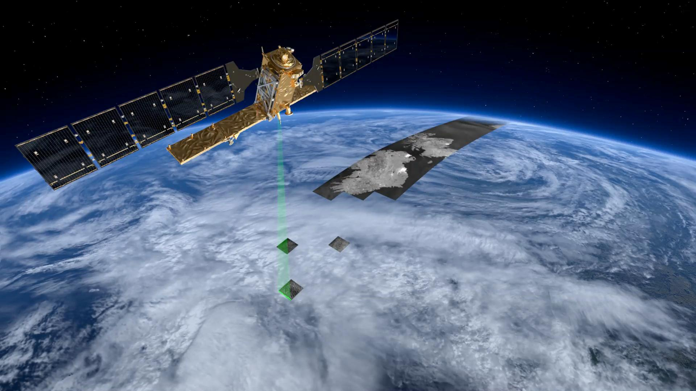

Hi, I am Nicolas and this is my personal website !

I am a research and teaching assistant in the geomatics lab of the <a href="https://uclouvain.be/en/research-institutes/eli/">Earth & Life Institute</a> at <a href="https://uclouvain.be/">UCLouvain</a>.

## Research

I am currently working on the *Sentinels for Agricultural Statistics* (Sen4Stat) project funded by the *European Space Agency* (ESA).

The overall objective for the Sen4Stat project is to facilitate the uptake of *Earth Observation* (EO) information in the National Statistical Offices (NSO) supporting the agricultural statistics. Special attention shall be given to develop and demonstrate EO products and best practices for agriculture monitoring relevant for *Sustainable Development Goals* (SDG) reporting and monitoring their progress at national scale.

## Teaching

I am supervising the practical work of the *Land monitoring by advanced Earth Observation* (LBRAT2104) course since its creation in 2020.

>This course is part of the University Certificate in Applied Geomatics available to professionals.

<figure class="image">
    
    <figcaption>ESA - Sentinel-1</figcaption>
</figure>

